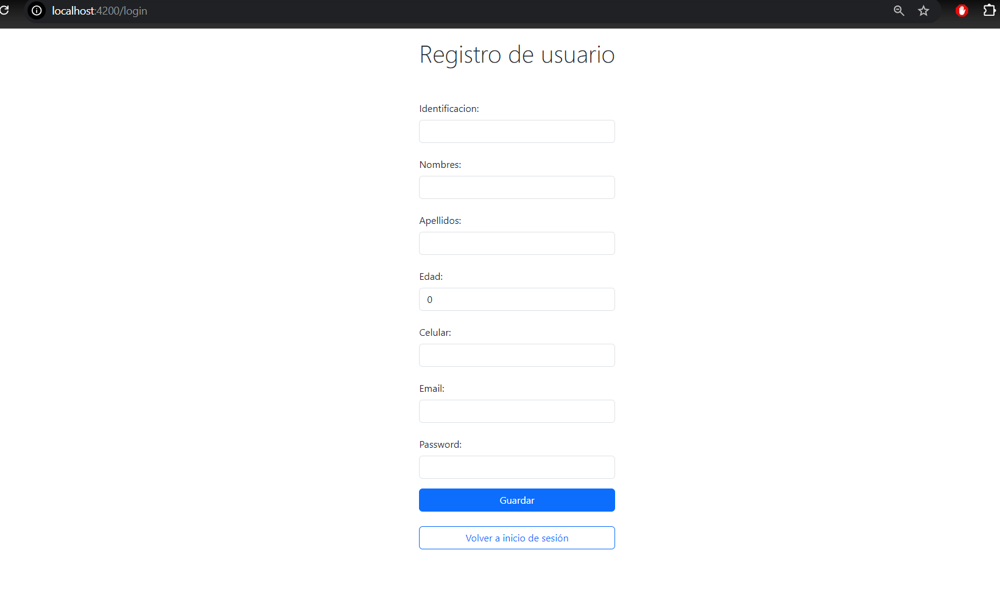

# Deber N2
## Requerimientos:

REALIZAR UN SISTEMA DE MANEJO DE UNA LISTA DE PERSONAS:
```
UNA PERSONA TIENE LOS SIGUIENTES DATOS:
 * IDENTIFICACIÓN
 * NOMBRES
 * APELLIDOS
 * EDAD
 * EMAIL
 * CELULAR(OPCIONAL)

EL SISTEMA CUENTA CON UN MÓDULO DE INICIO DE SESIÓN CON LOS VALORES POR DEFECTO DE vmtdev@mail.com - 123456. - Dev Bootcamp
ADEMÁS, EL SISTEMA DEBE MOSTRAR EN EL HEADER EL NOMBRE DE USUARIO CUANDO SE HAYA INICIADO SESIÓN.
```

CONSIDERACIONES:
```
* USAR ALERTA DE BOOTSTRAP O TOAST PARA MENSAJES DE ERROR O ÉXITO.
* USAR MÓDULOS PARA LAS RUTAS
* LOS DATOS POR DEFECTO SOLO DEBEN PODER AGREGAR MÁS PERSONAS
* SI NO REGISTRA CELULAR MOSTRAR EL LABEL(NO TIENE)
```

## INTEGRANTES: 
* Derek Mejía
* Christell Bacor

## PARA INGRESAR CON USUARIO DEFAULT UTILIZAR LAS SIGUIENTES CREDENCIALES:
* User: default
* Password: default

## CAPTURAS





## FIN